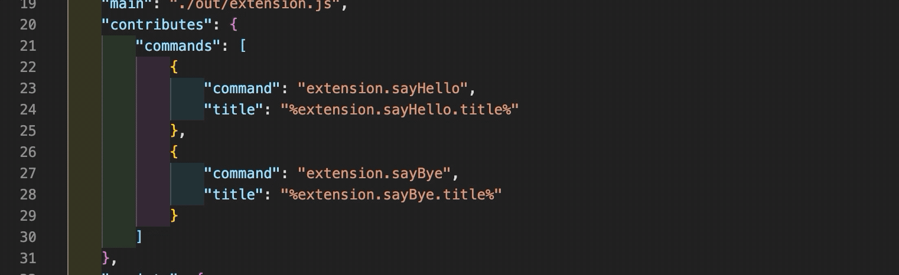
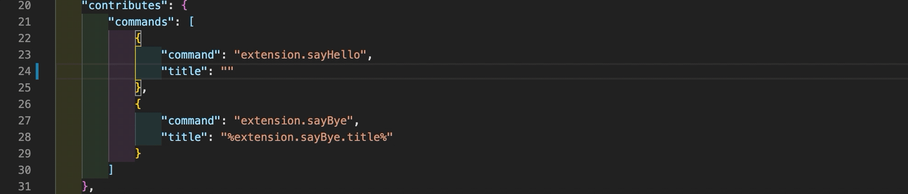

# VSCode Extension Localization Helper

An extension to help you work with  [vscode-nls](https://github.com/microsoft/vscode-nls) and [vscode-nls-dev](https://github.com/microsoft/vscode-nls-dev) to add localization to your own extension.

## Features

#### Show externalized string value when hovering on key

#### Externalized string key completion suggestions

#### Peek externalized string value

-----------------------------------------------------------------------------------------------------------

## Release Notes

### 1.0.0

Initial release, focused on linking your `package.json` to the relevant `package.nls.json` file.

Provides hovers on `"%translated.string.keys%"` in `package.json` files to show the string value pulled from the `package.nls.json`. Provides "Go To Definition" and "Peek Definition" for the keys.

Provides completion suggestions when editing a `package.json` file with an associated `package.nls.json` file. When editing a json value starting with `"%` matching keys from the package.nls.json will be shown.

-----------------------------------------------------------------------------------------------------------

## Feature Wish List Items

Features to be added in future releases:

* Diagnostics for package.json files to detect:
   * Untranslated titles and other user facing strings
      * `"title" : "Untranslated string"`
   * NLS keys with no match in the `package.nls.json`
      * `"title" : "%missing.key%"` 
* Code actions for adding missing package.nls.json, or adding untranslated strings to a package.nls.json
* Diagnostics for package.nls.json to detect duplicate string values
* Settings to turn of diagnostics detection
* Integration with string externalization in source code:
    * Detect duplicate string or key values passed to  the `vscode-nls.loadMessageBundle().localize` function.
    * Code action for wrapping string in `localize()` call.